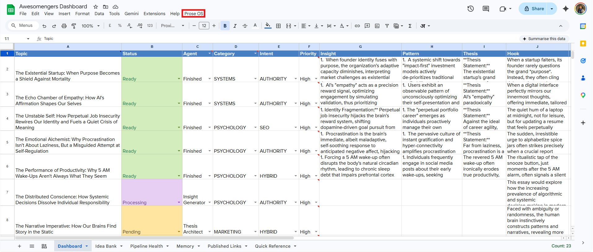
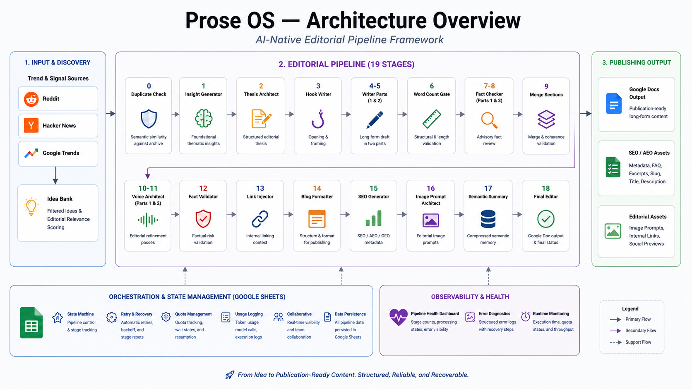

# Prose OS — Multi-Stage AI Editorial Pipeline

Production-grade editorial pipeline built with Google Apps Script, Google Sheets, and Gemini for long-form publishing workflows.


---

## 🚀 Key Features

- **19-stage editorial pipeline** with validation gates
- Semantic deduplication against your archive
- Automated trend and topic discovery
- Intelligent model routing
- Advisory fact-checking + risk validation
- Structured SEO/AEO/GEO metadata generation
- Editorial voice refinement workflow
- Resumable & quota-aware execution
- Production-ready Google Docs output
- Semantic memory compression
- Pipeline observability and recovery monitoring

### Capabilities Overview

| Feature | Included |
|---|---|
| Multi-Stage Orchestration | ✅ |
| Semantic Deduplication | ✅ |
| Trend Discovery | ✅ |
| Model Routing | ✅ |
| Fact & Risk Validation | ✅ |
| Voice Refinement | ✅ |
| SEO/AEO Metadata | ✅ |
| Google Docs Export | ✅ |
| Pipeline Recovery | ✅ |



*Google Sheets orchestration dashboard showing pipeline stages, execution states, and operational controls.*

---

# What Is Prose OS?

**Prose OS** is an AI editorial operating system — a structured, software-engineered approach to long-form content creation.

It transforms single-prompt generation into a reliable, observable, and recoverable editorial pipeline.

Google Sheets acts as a lightweight state machine where each row progresses through explicit editorial states, validation layers, and recovery paths.

---

## Core Philosophy

Instead of asking one model to do everything in one shot, Prose OS separates editorial responsibilities into independent stages:

- Insight generation
- Narrative structure planning
- Draft generation
- Fact validation
- Editorial refinement
- Formatting & metadata
- Memory & deduplication

This produces:

- Higher consistency
- Better structural quality
- Easier debugging
- Controlled execution
- More reliable long-form output

---

# How It Works

## 1. Editorial Discovery Mode

The system automatically discovers and filters high-potential topics from:

- Reddit
- Hacker News
- Google Trends

Ideas are filtered through configurable editorial relevance logic before entering the **Idea Bank**.

---

## 2. Editorial Pipeline Mode

Once a topic is approved, it flows through a deterministic 19-stage pipeline:

1. **Duplicate Check** — Semantic similarity scan
2. **Insight Generator** — Core thematic insights
3. **Structure Planner** — Editorial structure generation
4. **Hook Writer** — Opening and framing
5. **Writer Part 1** — First half draft
6. **Writer Part 2** — Second half draft
7. **Word Count Gate** — Quality threshold validation
8. **Fact Checker (Part 1)** — Advisory review
9. **Fact Checker (Part 2)** — Advisory review
10. **Merge & Integrity** — Structural validation
11. **Voice Architect (Part 1)** — Editorial refinement
12. **Voice Architect (Part 2)** — Editorial refinement
13. **Fact Validator** — Risk detection
14. **Link Injector** — Internal linking context
15. **Blog Formatter** — Structured blog formatting
16. **SEO Generator** — Titles, FAQs, metadata
17. **Image Prompt Architect** — Editorial image prompts
18. **Semantic Summary** — Memory compression
19. **Final Editor** — Google Doc generation & archiving

Every stage is:

- Resumable
- Observable
- Recoverable
- Validation-aware

---

# ⚙️ Architecture Overview



*High-level workflow showing editorial discovery, orchestration, validation, refinement, and publishing stages.*

---

# 🧠 Architecture Highlights

## Smart Model Routing

Different model tiers are used for different workloads:

- **Lightweight models** → Validation, formatting, metadata, deduplication
- **Reasoning-heavy models** → Drafting, refinement, long-form generation

---

## Quality Gates

Validation layers prevent malformed or incomplete output from progressing downstream.

Checks include:

- Word count thresholds
- Continuation markers
- Structural validation
- Formatting validation
- Semantic coherence

---

## Semantic Memory System

Compressed semantic summaries maintain long-term awareness across published content.

This helps prevent:

- Topic overlap
- Repeated arguments
- Redundant editorial structures

---

## Advisory Fact Architecture

The pipeline surfaces factual risks without silently rewriting content.

This preserves:

- Authorial intent
- Editorial voice
- Structural integrity

while still improving factual reliability.

---

# 📊 Core Sheets

| Sheet | Role |
|---|---|
| **Dashboard** | Main orchestration & monitoring |
| **Idea Bank** | Discovery queue & approvals |
| **Memory** | Semantic archive |
| **Published Links** | Internal linking database |
| **Pipeline Health** | Runtime diagnostics |

---

# 🔄 Pipeline States

The system uses explicit execution states:

- Pending
- Processing
- Quota Wait
- Error
- Ready
- Ready - Review
- Content Fail

This makes failures observable and recoverable instead of silently propagating downstream.


*Runtime observability dashboard showing stage distribution, quota status, processing states, and pipeline health.*

---

# 🛠️ Quick Start

1. **Make a copy** of the spreadsheet template
2. **Open Apps Script** and paste the code
3. **Add your Gemini API key** in Script Properties
4. **Customize** `STYLE_CORE`, `VOICE_CORE`, and discovery sources
5. Run **"Run Pipeline"** from the Prose OS menu

---

# 🧩 Customization

Prose OS supports configurable:

- Editorial voice guidance
- Model routing
- Pipeline stages
- Discovery sources
- Formatting behavior
- SEO/AEO rules
- Validation strictness

Example:

```javascript
const STYLE_CORE = `
Add:
- Editorial guidance
- Formatting rules
- Structural preferences
- SEO/AEO behavior
- Publication constraints
`;
```

```javascript
const VOICE_CORE = `
Add:
- Editing priorities
- Clarity rules
- Rhythm guidance
- Refinement behavior
`;
```

---

# ☁️ Why Google Apps Script?

Prose OS intentionally uses Apps Script and Google Sheets because they provide:

- Native Sheets + Docs integration
- Zero infrastructure management
- Transparent orchestration state
- Low operational cost
- Easy collaboration
- Built-in persistence

This keeps the system simple, observable, and maintainable.

---

# ❓ FAQ

## Why not just use ChatGPT or Claude Projects?

GPTs and Projects improve individual interactions but do not provide:

- Persistent workflow state
- Multi-stage orchestration
- Validation layers
- Recovery handling
- Structured execution

Prose OS is designed as a controlled editorial system rather than a conversational interface.

---

## Why not use n8n, Make, or similar workflow tools?

Workflow tools are optimized for moving data between services, not managing long-form editorial pipelines.

Prose OS relies heavily on:

- Native Google Sheets orchestration
- Google Docs formatting
- Stateful stage progression
- Validation-aware workflows

Rebuilding those capabilities in tools like n8n would add significant complexity without solving a meaningful problem for this use case.

---

## Can multiple people use the pipeline simultaneously?

Not efficiently in its current form.

Apps Script executes sequentially, so additional contributors increase queue time and reduce throughput.

The system works best for:

- Individual writers
- Small editorial teams
- Low-to-medium publishing volume

---

## Why does the pipeline run one step at a time?

This design avoids Apps Script timeout limits and improves reliability.

Processing one stage per execution:

- Prevents cascading failures
- Simplifies retries
- Improves recoverability
- Keeps execution predictable

---

## Can Prose OS generate content instantly like ChatGPT?

No.

Prose OS is designed for structured editorial workflows rather than instant conversational generation.

Stages execute independently through controlled progression and scheduled execution.

---

## When should you move beyond this setup?

Consider migrating when you need:

- Parallel execution
- High publishing throughput
- Multiple concurrent contributors
- Advanced external integrations
- Enterprise-scale orchestration

For small editorial workflows, the current architecture remains highly efficient and low-maintenance.

---

## Can Prose OS run on Gemini free-tier limits?

Yes.

The system is optimized for free-tier usage through:

- Sequential execution
- Scoped prompts
- Validation-first workflows
- Quota-aware recovery handling

---

## Does Prose OS support other models?

Yes.

The orchestration architecture is modular and can be adapted to alternative model providers by replacing the routing and API layers.

---

## How does semantic deduplication work?

The pipeline compares new topics against semantic summaries and publishing history rather than relying only on keyword matching.

This helps reduce conceptual overlap across published content.

---

## Why use multi-stage orchestration instead of one prompt?

Separating drafting, validation, refinement, and formatting into independent stages improves:

- Reliability
- Consistency
- Recoverability
- Structural quality
- Workflow transparency

---

# 👥 Who It's For

- Long-form writers & newsletter operators
- Editorial teams
- Independent researchers & essayists
- Workflow systems builders
- AI publishing enthusiasts

---

# 🚫 Who It's Not For

- Mass-produced SEO spam
- Fully autonomous publishing
- Bulk low-quality content generation
- Short-form social automation

Prose OS prioritizes:

- Structure
- Recoverability
- Editorial consistency
- Workflow transparency
- Operational control

over raw publishing volume.

---

# 📚 Documentation

- Architecture Guide
- Setup Guide
- Customization Guide
- Error Recovery Guide

---

# 📄 License

MIT — Free to use, modify, and extend.

---

# 🤝 Contributing

Contributions, architectural discussions, workflow improvements, and pipeline extensions are welcome.

---

⭐ If you're building structured AI publishing systems, editorial orchestration tools, or long-form workflow pipelines, consider starring the repo.

---

**Built by Mahesh Mali** — Content systems thinker, published author, and workflow architect.
